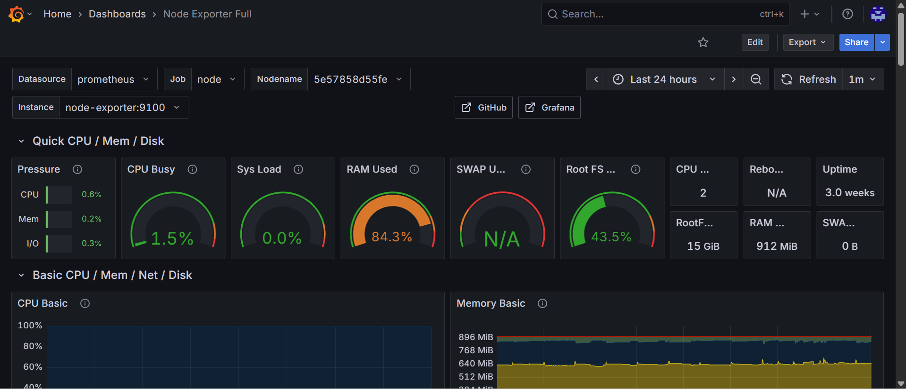
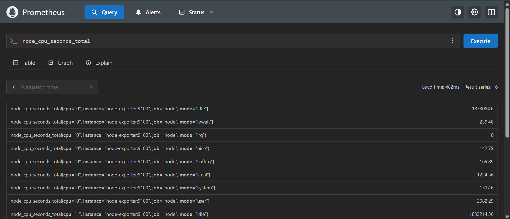

# Monitorar EC2 com Prometheus e Grafana

---
## 1.0 Problema e Justificativa

Na empresa, a **automação de processos** é crucial e gerenciada por fluxos do **N8N** hospedados em uma instância **EC2** da AWS. A ausência de um sistema de **monitoramento proativo** representa um risco, pois não há visibilidade em tempo real sobre a saúde e o desempenho da infraestrutura. A falta de métricas e alertas impede a identificação rápida de gargalos, falhas ou problemas de capacidade, podendo afetar a disponibilidade dos serviços.

### Pré-requisitos

- **Docker** v19.03 ou superior
    
- **Docker Compose** v1.27 ou superior
    
- Acesso a uma instância **EC2**
    
- Portas `80`, `8080`, `9090`, `9001` devem estar disponíveis na máquina local ou na EC2, dependendo do ambiente de execução.
    

---

## 2.0 Objetivo do Projeto

O objetivo principal deste projeto é implementar um sistema de monitoramento robusto e eficiente para a infraestrutura da EC2. A solução deve permitir a **coleta de métricas** em tempo real e a **visualização desses dados** por meio de dashboards intuitivos, garantindo a sustentabilidade e a confiabilidade da nossa aplicação N8N.

### Objetivos Específicos

- Implementar um ambiente de monitoramento **isolado** e **escalável** utilizando contêineres Docker, sem impactar a aplicação principal.
    
- Utilizar o **Prometheus** para coletar métricas de desempenho da EC2, como uso de CPU, memória, disco e rede.
    
- Configurar o **Grafana** para consumir os dados do Prometheus e exibir dashboards customizáveis e fáceis de entender.
    
- Estruturar o projeto de forma que permita, futuramente, a **expansão do monitoramento** para a própria aplicação do N8N (nível de aplicação).
    

---

## 3.0 Desenvolvimento e Arquitetura

### 3.1 Entendendo as Ferramentas

Para construir a solução, utilizamos duas ferramentas-chave: **Prometheus** e **Grafana**. Ambas são amplamente adotadas na indústria para observabilidade de sistemas.

- **Prometheus: O Coletor de Métricas** O Prometheus é um sistema de monitoramento e alerta de código aberto. Sua principal característica é a arquitetura baseada em **"pull"**: ele periodicamente **busca** as métricas diretamente de seus alvos (chamados de **"targets"**), em vez de recebê-las passivamente.
    
    - **Como Funciona a Coleta de Dados?**
        
        1. **Expositores de Métricas:** As aplicações ou sistemas que queremos monitorar precisam expor suas métricas em um endpoint HTTP (`/metrics`). Para a EC2, usaremos um agente chamado **Node Exporter**, que transforma as métricas do sistema em um formato que o Prometheus entende.
            
        2. **Scraping:** O servidor do Prometheus é configurado para, a cada certo intervalo, fazer um **"scrape"** (raspar) nesse endpoint, coletando as métricas.
            
        3. **Armazenamento:** Os dados coletados são armazenados em um banco de dados de séries temporais (**TSDB**), que é otimizado para lidar com dados de tempo.
            
- **Grafana: O Visualizador de Dados** O Grafana é uma plataforma de **código aberto para análise e visualização de dados**. Ele não coleta métricas por si só. Sua função é se conectar a fontes de dados, como o Prometheus, e transformar as métricas em **dashboards** visuais e interativos.
    
    - **Como Funciona a Visualização?**
        
        1. **Conexão com a Fonte:** O Grafana se conecta ao servidor do Prometheus, configurado como sua fonte de dados.
            
        2. **Criação de Dashboards:** Utilizando a linguagem de consulta do Prometheus (**PromQL**), é possível criar painéis (panels) que exibem as métricas em diferentes formatos: gráficos, tabelas, gauges e muito mais.
            
        3. **Monitoramento em Tempo Real:** Uma vez configurados, os dashboards do Grafana oferecem uma visão clara e contínua do estado da infraestrutura.

### 3.2 Arquitetura da Solução

Para garantir o isolamento e a facilidade de implantação, a solução foi arquitetada para ser executada em contêineres Docker.
![[Gemini_Generated_Image_5vdc9r5vdc9r5vdc.png]]
Essa arquitetura se baseia em três componentes principais:

1. **Node Exporter:** Um agente leve que roda diretamente na EC2 e expõe métricas de sistema no endpoint `/metrics`.
    
2. **Prometheus:** O servidor que faz o **scrape** das métricas do Node Exporter.
    
3. **Grafana:** A interface de visualização que consome os dados do Prometheus para exibir dashboards.
    
### 3.3 Estrutura do Projeto e Configuração

Para automatizar a implantação, usamos o **Docker Compose**. A estrutura de arquivos é a seguinte:
#### `docker-compose.yml`

```YAML

version: '3.8'

services:
  node-exporter:
    image: prom/node-exporter:latest
    container_name: node-exporter
    restart: unless-stopped
    volumes:
      - /proc:/host/proc:ro
      - /sys:/host/sys:ro
      - /:/rootfs:ro
    command:
      - '--path.procfs=/host/proc'
      - '--path.rootfs=/rootfs'
      - '--path.sysfs=/host/sys'
      - '--collector.filesystem.mount-points-exclude=^/(sys|proc|dev|host|etc)($$|/)'
    expose:
      - 9100
    networks:
      - rede-compartilhada

  prometheus:
    image: prom/prometheus:latest
    container_name: prometheus
    restart: unless-stopped
    volumes:
      - ./prometheus.yml:/etc/prometheus/prometheus.yml
      - prometheus_data:/prometheus
    command:
      - '--config.file=/etc/prometheus/prometheus.yml'
      - '--storage.tsdb.path=/prometheus'
      - '--web.console.libraries=/etc/prometheus/console_libraries'
      - '--web.console.templates=/etc/prometheus/consoles'
      - '--web.enable-lifecycle'
    ports:
      - "9090:9090"
    networks:
      - rede-compartilhada

  grafana:
      image: grafana/grafana:latest
      container_name: grafana
      restart: unless-stopped
      volumes:
        - grafana_data:/var/lib/grafana
      ports:
        - "3000:3000"
      environment:
        - GF_DATABASE_TYPE=postgres
        - GF_DATABASE_HOST=caminho-para-aws-rds
        - GF_DATABASE_NAME=grafana
        - GF_DATABASE_USER=grafana
        - GF_DATABASE_PASSWORD=senha-do-usuario
      networks:
        - rede-compartilhada

# Seção de volumes para persistir os dados

volumes:
  prometheus_data:
  grafana_data:

networks:
  rede-compartilhada:
    external: true
```

🚨Para que nossos contêineres possam se comunicar de forma segura e privada, criamos a **rede compartilhada `rede-compartilhada`** com o comando `docker network create`. Essa solução é fundamental para o futuro, pois permitirá que o **Prometheus** colete as métricas do contêiner do N8N de maneira eficiente e isolada, garantindo que a comunicação entre eles não afete a rede principal.

- **`prometheus.yml`**: Este arquivo de configuração do **Prometheus** define os alvos a serem monitorados. Ele é crucial para a coleta de dados.

```YAML
global:
  scrape_interval: 30s
  evaluation_interval: 30s

scrape_configs:
  - job_name: 'prometheus'
    static_configs:
      - targets: ['localhost:9090']
  - job_name: 'node'
    static_configs:
      - targets: ['node-exporter:9100']
```

#### `3.4 Instruções para Execução`

1. Clone o repositório ou crie a estrutura de diretórios conforme mostrado acima.
    
2. Navegue até o diretório raiz do projeto.
    
3. Execute o comando para subir os contêineres: `docker-compose up -d`
    
4. Após a execução, você pode acessar as interfaces:
    
    - **Prometheus:** `http://localhost:9090`
        
    - **Grafana:** `http://localhost:3000`
        

---

## 4.0 Resultados e Próximos Passos

### Resultados Alcançados

- A solução de monitoramento foi implementada com sucesso, rodando em um ambiente isolado em contêineres Docker.
    
- Métricas de CPU, memória, disco e rede da EC2 estão sendo coletadas em tempo real pelo Prometheus.
    
- Um dashboard inicial foi configurado no Grafana, exibindo os principais indicadores de saúde da instância.






